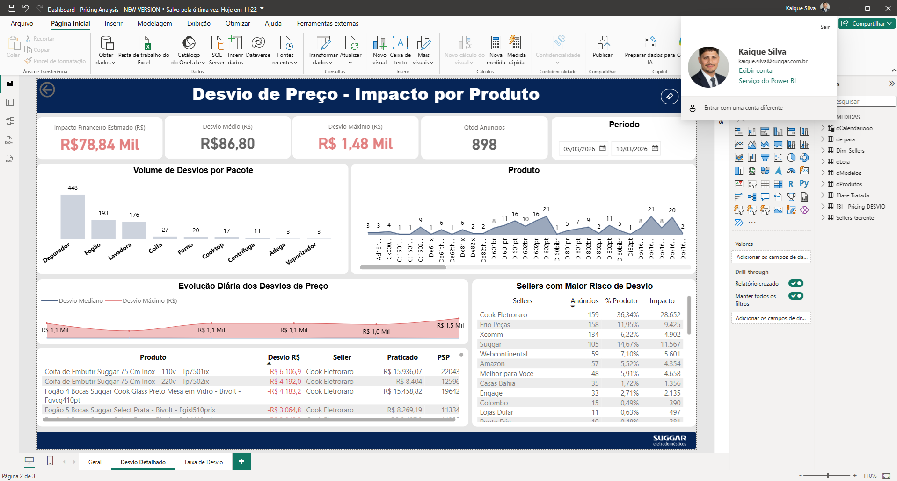
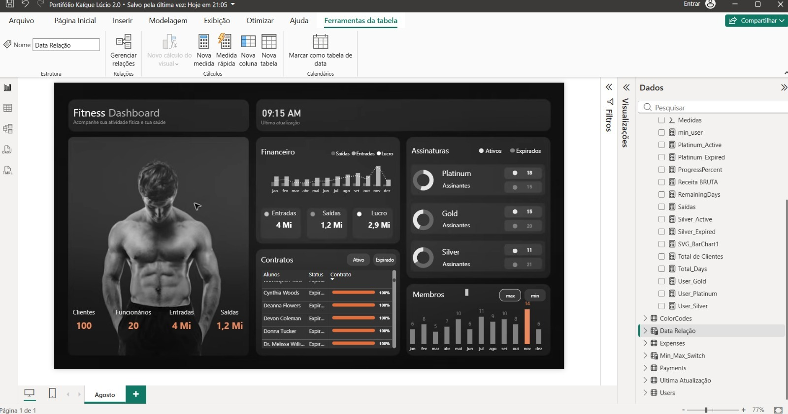

# Portfólio - Kaique Lucio

Analista de Dados com mais de 5 anos de experiência em inteligência de mercado, análise de preços e monitoramento de concorrência. Especialista em Power BI e modelagem de dados, com foco na criação de dashboards estratégicos e KPIs que suportam a tomada de decisão da alta liderança.

Tenho histórico comprovado na entrega de análises que geram impacto financeiro, otimizam processos e auxiliam a definir estratégias competitivas em ambientes complexos e dinâmicos.

---

## Projetos

### Monitoramento de Desvio de Preço

Dashboard desenvolvido para monitorar anúncios em marketplaces e identificar desvios em relação ao preço sugerido (PSP), com foco em reduzir perdas financeiras e garantir compliance de preços.

**Resultados e impacto:**

- Identificação de desvios que representavam um impacto financeiro estimado superior a R$ 60 mil mensais  
- Apoio na priorização de correções, reduzindo em 15% os desvios em 3 meses  
- Mapeamento dos sellers e marketplaces com maior risco, facilitando ações corretivas direcionadas  

**Principais análises:**

- Impacto financeiro estimado dos desvios  
- Marketplaces com maior incidência de anúncios fora do PSP  
- Sellers com maior risco de desvio  
- Produtos com maior volume de inconsistências  
- Evolução diária dos desvios de preço  

**Ferramentas:**  
Power BI, Excel

---

### Análise de Competitividade de Preços no Mercado

Dashboard para análise comparativa de preços entre marcas, lojas e marketplaces, permitindo identificar oportunidades de ajuste de preço e posicionamento competitivo.

**Resultados e impacto:**

- Identificação de produtos com potencial para reposicionamento, aumentando a competitividade e participação de mercado  
- Mapeamento de marcas e marketplaces mais estratégicos para ações comerciais  
- Apoio na negociação com parceiros comerciais via dados concretos de mercado  

**Principais análises:**

- Comparação de preços entre marcas  
- Identificação do menor preço praticado no mercado  
- Volume de anúncios por marketplace  
- Distribuição de produtos por marca  
- Histórico do preço mais praticado ao longo do tempo  

**Ferramentas:**  
Power BI, Excel, WebPrice

---

### Monitoramento de Desvio por Produto e Seller

Dashboard focado em identificar e priorizar desvios de preço em anúncios de marketplaces, oferecendo visão granular sobre produtos, sellers e marketplaces com maior impacto financeiro.

**Resultados e impacto:**

- Auxílio na redução do desvio médio em até 20% após recomendações baseadas no dashboard  
- Priorização eficaz das ações corretivas em produtos e sellers críticos  
- Visibilidade consolidada para tomada de decisão da liderança comercial  

**Principais análises:**

- Distribuição de desvios por faixa de valor (até R$100, R$100–R$300, R$300–R$500 e acima de R$500)  
- Volume de desvios por produto  
- Sellers com maior risco de desvio de preço  
- Marketplaces com maior incidência de anúncios fora do PSP  
- Estimativa de impacto financeiro dos desvios  
- Identificação dos anúncios mais críticos para correção  

**Ferramentas:**  
Power BI, Excel, SQL

---

### Dashboard de Gestão para Academia (Consultoria Externa)

Dashboard desenvolvido como projeto de consultoria para uma academia, com o objetivo de centralizar indicadores operacionais, financeiros e de assinaturas em um único painel interativo. A solução permite acompanhar em tempo real o desempenho do negócio, facilitando a análise de receitas, contratos e crescimento da base de alunos.

**Resultados e impacto:**

- Centralização dos principais indicadores operacionais e financeiros em um único dashboard  
- Melhor visibilidade sobre receitas, despesas e lucro mensal da academia  
- Monitoramento claro do status das assinaturas (ativas e expiradas)  
- Identificação rápida de contratos próximos ao vencimento, permitindo ações de renovação  
- Apoio à gestão na tomada de decisões estratégicas sobre retenção de alunos e crescimento da receita  

**Principais análises:**

- Evolução financeira mensal (entradas, saídas e lucro)  
- Distribuição de assinantes por tipo de plano (Platinum, Gold e Silver)  
- Comparação entre assinaturas ativas e expiradas  
- Monitoramento do progresso e status de contratos dos alunos  
- Evolução mensal de novos membros  
- Indicadores gerais do negócio (clientes, funcionários, receitas e despesas)

**Ferramentas:**  
Power BI, Excel, DAX

---

## Contato

- Telefone: (31) 97358-3529
